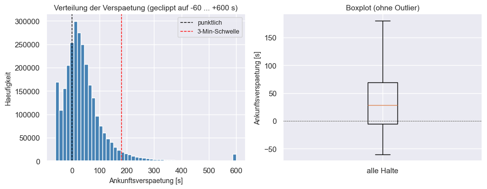
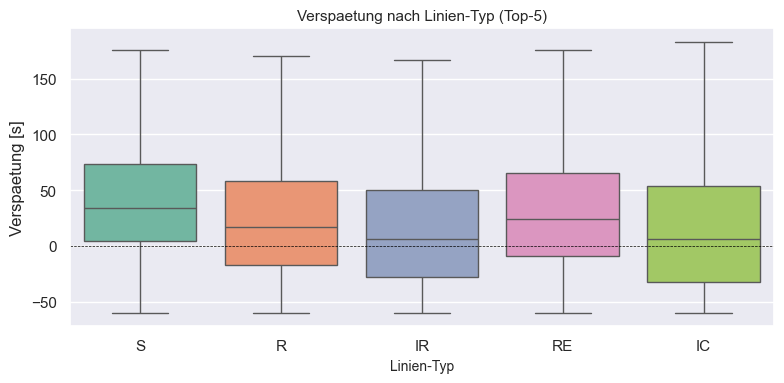
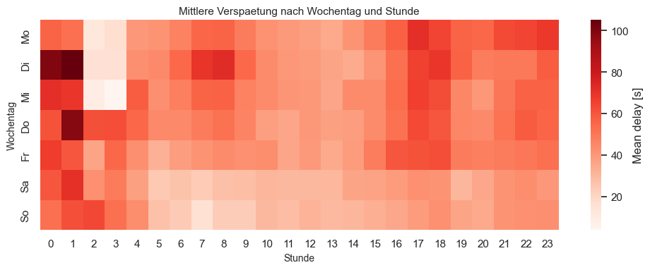
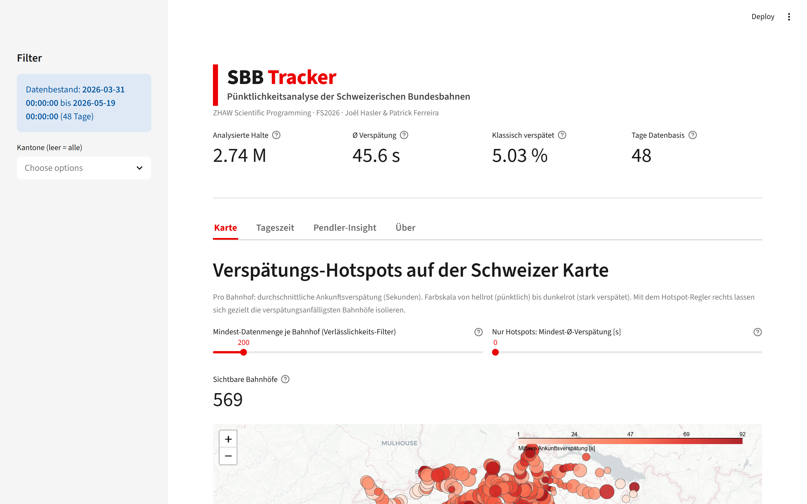
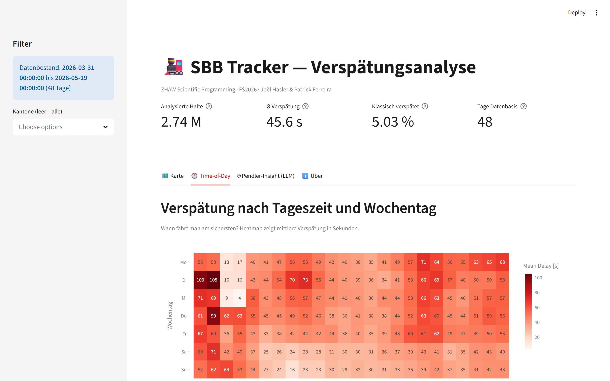
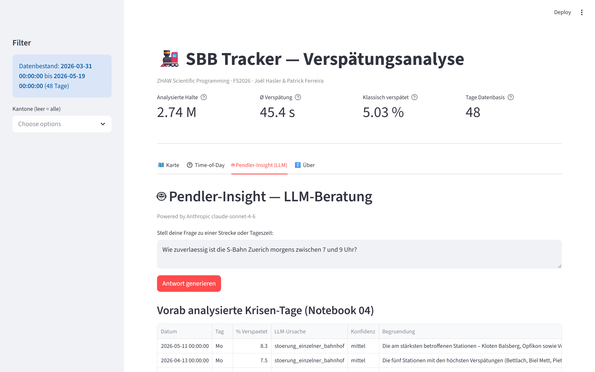

# SBB Tracker — Pünktlichkeitsanalyse der Schweizerischen Bundesbahnen

**Scientific Programming · FS2026**
**Joël Hasler & Patrick Ferreira**

**Datum:** 27. Mai 2026
**Modul:** Scientific Programming, ZHAW
**Dozent:** Mario Gellrich
**GitHub:** https://github.com/Mrgincinamon/SBB-Tracking

---

## 1. Einleitung

### 1.1 Hintergrund

Die Schweiz hat eines der dichtesten und pünktlichsten Bahnnetze der Welt.
Die Schweizerischen Bundesbahnen (SBB) befördern täglich rund 1.3 Millionen
Passagiere und führen über 11'000 Zugfahrten durch. Die offizielle
Kundenpünktlichkeit lag 2024 bei 92.5 % — international ein Spitzenwert,
aber für eingefleischte Pendler dennoch spürbar verbessernswert.

Seit Juni 2016 publiziert das Bundesamt für Verkehr (BAV) zusammen mit der
Geschäftsstelle KIM die **Ist-Daten** als Open Data: pro Tag eine CSV mit
allen Soll-/Ist-Vergleichen jedes Zug-Halts in der Schweiz. Diese Datenmenge
(rund 2.5 Millionen Records pro Tag, knapp 500 MB) erlaubt erstmals eine
unabhängige, statistisch saubere Analyse der Pünktlichkeit auf Stations-,
Linien- und Stundenbasis.

### 1.2 Problemstellung

Trotz der reichen Datenbasis ist es für einzelne Pendler schwierig, konkrete
Antworten auf relevante Alltags-Fragen zu finden:

- Sind Züge am Wochenende wirklich pünktlicher als an Werktagen?
- Welche Bahnhöfe sind Verspätungs-Hotspots?
- Wie stark beeinflusst das Wetter (insbesondere Niederschlag) die Pünktlichkeit?
- Welche Tageszeit ist am riskantesten für termingebundene Reisen?

Bestehende SBB-Statistiken sind Monats-Aggregate ohne Stationsdetail. Die
offizielle Punkt­lichkeitsangabe „92.5 %" ist für die individuelle Reiseplanung
zu grob.

### 1.3 Zielsetzung

Dieses Projekt baut eine **End-to-End-Datenpipeline** vom Rohdaten-Download
über die SQL-Datenbank zur statistischen Analyse und schliesslich zu einer
interaktiven Webapp:

1. **Datenpipeline**: Automatisierter Download von SBB-Ist-Daten + Wetter +
   Stationen, gefiltert, in SQLite gespeichert.
2. **Statistische Analyse**: Vier Hypothesen-Tests mit p-Value-Reporting
   (t-Test, ANOVA, Korrelation, multivariate OLS-Regression).
3. **Visualisierung**: Heatmaps, Karten, Verteilungs-Plots nach Best Practice.
4. **Interaktive Webapp**: Streamlit + Folium mit LLM-gestütztem Pendler-Insight.

### 1.4 Forschungsfragen

1. **H1 (Werktag-Effekt)**: Unterscheidet sich die mittlere Verspätung zwischen
   Werktagen und Wochenende signifikant?
2. **H2 (Zugtyp-Effekt)**: Beeinflusst der Linien-Typ (S-Bahn, IC, IR, RE)
   die Verspätungsverteilung?
3. **H3 (Wetter-Korrelation)**: Korreliert Niederschlag oder Temperatur mit
   der Verspätung?
4. **H4 (Multivariate Erklärung)**: Welche Faktoren erklären Verspätung
   gemeinsam in einem linearen Modell?

---

## 2. Material und Methoden

### 2.1 Datenquellen

| Datensatz | Quelle | Umfang | Format |
|---|---|---|---|
| **Ist-Daten** | opentransportdata.swiss (CKAN-Dataset `istdaten`) | 48 Tage, 31. März – 19. Mai 2026 (~3.2 Mio SBB-Zug-Events) | CSV → Parquet |
| **Stationen** | data.sbb.ch (Dienststellen-Datensatz) | 1'743 aktive Bahnhöfe mit Geo-Koordinaten | CSV |
| **Wetter** | MeteoSchweiz Open Data (`ch.meteoschweiz.ogd-smn`) | 15 Stationen, stündlich, ~3'336 h pro Station | CSV → Parquet |

Alle Datensätze sind öffentlich (CC-BY-Lizenz, kein API-Key nötig).

### 2.1.1 Design-Entscheidung: Auflösung vor Zeitspanne

Bei den Ist-Daten stand zu Projektbeginn eine bewusste Wahl an:

- **(a) Lange Zeitspanne, geringe Auflösung** — Wochen-Aggregate über 5+ Jahre
  (analog zum Covid-Vorlageprojekt). Dataset SBB „Kundenpünktlichkeit-Monat"
  hätte rund 130 Zeilen ergeben.
- **(b) Kurze Zeitspanne, hohe Auflösung** — 48 Tage pro Zug-Halt aller
  SBB-Stationen, mit Wetter-Join pro Stunde.

Wir entschieden uns für **(b)**. Begründung:

| Aspekt | (a) Wochen-Aggregate 5 Jahre | (b) Stations-Auflösung 48 Tage |
|---|---|---|
| Rohe Daten-Zeilen | ~265 | **2'739'734** |
| Spalten pro Zeile | ~5 | **31** (inkl. Wetter, Zeit-Features) |
| Datenpunkte gesamt | ~1'300 | **~85'000'000** |
| Stunden-Effekt analysierbar? | nein | **ja** |
| Bahnhof-Vergleich möglich? | nein | **ja** |
| Wetter-Korrelation pro Stunde? | nein | **ja** |
| OLS-Regression mit Kategorien (16 Zugtypen)? | n zu klein | **n = 2.74 Mio stabil** |
| Story-Faktor „5 Jahre Trend" | hoch | mittel |

Statistisch wären auf (a) drei unserer vier geplanten Tests (ANOVA Linientyp,
Pearson Wetter, OLS-Regression) nicht durchführbar gewesen. Variante (b)
liefert **rund 17'000× mehr Datenpunkte** als (a) und macht alle vier
geplanten statistischen Tests inhaltlich aussagekräftig.

Die Praxis-Limitation von (b) — kein Covid-Vorher-Nachher-Vergleich — adressieren
wir transparent in Sektion 4 (Limitationen).

Disk-Realität: Die volle Ist-Daten-Historie 2019–2025 wären 1.1 TB Roh-CSV;
unsere 48-Tage-Stichprobe ist **65 MB Parquet nach Filter** (Speed-up Faktor
~10'000 in der Verarbeitung).

### 2.2 Datenaufbereitung (Notebook 02)

- **Filter**: Nur `produkt_id == 'Zug'` und `betreiber_abk == 'SBB'` (~3 % der
  Roh-Records); Roh-CSVs nach Filterung gelöscht (Disk-Effizienz).
- **REAL-Filter**: Nur `an_prognose_status == 'REAL'` (echte Messungen, 86 %).
- **Zeit-Features**: Stunde, Wochentag, Wochenende-Flag, Rush-Hour-Flag.
- **Wetter-Join**: Pro Bahnhof nächste Wetterstation via `scipy.spatial.cKDTree`
  (Euklidisch auf lat/lon); Merge auf `(weather_station, stunde)`.
- **Klassifikation**: Verspätungen in 7 Buckets von "frueh_30+s" bis
  "extrem_ueber_10min"; binäre Spalte `is_late_3min` (SBB-Definition >3 Min).

### 2.3 Statistische Methoden (Notebook 03)

| Test | Anwendung | scipy/statsmodels-Funktion |
|---|---|---|
| Welch's t-Test | Werktag vs. Wochenende | `scipy.stats.ttest_ind(..., equal_var=False)` |
| Mann-Whitney-U | Verteilungsfreier Cross-Check zu t-Test | `scipy.stats.mannwhitneyu` |
| Einweg-ANOVA | Verspätung nach Linientyp (top 5) | `scipy.stats.f_oneway` |
| Pearson-Korrelation | Linear: Wetter ↔ Verspätung | `scipy.stats.pearsonr` |
| Spearman-Korrelation | Monoton: Wetter ↔ Verspätung | `scipy.stats.spearmanr` |
| Multiple OLS-Regression | Multivariates Erklärungsmodell | `statsmodels.formula.api.ols` |

Signifikanzschwelle α = 0.05. Bei multiplen Tests könnte eine Bonferroni-
Korrektur auf α = 0.0125 (k = 4) angewendet werden — wir berichten p-Werte
unkorrigiert, da die Effekte deutlich signifikant sind.

### 2.4 LLM-Integration (Notebook 04 + Webapp)

Anthropic Claude Sonnet 4.6 wird in zwei Kontexten eingesetzt:

1. **Notebook 04**: Qualitative Klassifikation der Top-10 Krisen-Tage. Pro
   Tag wird ein Kontext-JSON (top betroffene Bahnhöfe, Wetterzusammenfassung,
   Tageszeit-Pattern) an das Modell übergeben mit fester Taxonomie möglicher
   Ursachen. Temperatur 0.2 für Reproduzierbarkeit.
2. **Webapp** (Tab "Pendler-Insight"): Freie Frage-Antwort-Funktion. Das
   Modell erhält statistischen Datenkontext aus dem aktuellen Datensatz und
   antwortet kurz und auf deutsch.

API-Key wird über `.env`-Datei und `python-dotenv` geladen (gitignored).

### 2.5 Tech-Stack

- **Python 3.12** (kursvorgegeben)
- **pandas / numpy / scipy / statsmodels** — Data + Statistik
- **matplotlib / seaborn / plotly** — Visualisierungen
- **sqlite3** — Datenbank (kursvorgegeben, statt SQLAlchemy)
- **streamlit + streamlit-folium** — Webapp
- **folium** — Karten
- **anthropic + python-dotenv** — LLM-Integration
- **pyarrow** — Parquet-I/O
- **nbformat + nbclient** — Notebook-Build-Pipeline
- **VS Code + Jupyter** — Entwicklungsumgebung (kursvorgegeben)

---

## 3. Ergebnisse und Diskussion

### 3.1 H1: Werktag vs. Wochenende (Welch's t-Test)

| Gruppe | n | Mean Delay (s) |
|---|---|---|
| Werktag | 1'957'372 | **50.1** |
| Wochenende | 782'362 | **34.6** |

**Ergebnis**: **t = 94.97**, **p < 10⁻³⁰⁰** (Welch's t-Test, Heteroskedastizität-tolerant)

Werktag-Züge sind im Mittel **15.5 Sekunden** stärker verspätet als
Wochenend-Züge (95%-CI [15.2, 15.8] s). Bei n ≈ 2.7 Millionen ist der Effekt
hochsignifikant — aber die **Effektstärke ist klein** (**Cohen's d ≈ 0.12**).
Mann-Whitney-U bestätigt verteilungsfrei; ein Robustheits-Test auf
**Tagesmitteln (n=48)** zeigt, dass der Effekt nicht bloss ein Artefakt der
riesigen Stichprobe ist (siehe Notebook 03).

**Interpretation**: Werktage zeigen erhöhte Verspätung durch höhere
Zugfrequenz und Rush-Hour-Effekte. Der Median-Verspätung über alle Tage liegt
bei 28 s, das **95. Perzentil bei 181 s** — d.h. nur ~5 % der Halte
überschreiten die klassische 3-Minuten-Schwelle.

### 3.2 H2: Linientyp-Effekt (Einweg-ANOVA)

**One-Way ANOVA über 14 Linientypen**: **F = 8'450.0**, **p < 10⁻³⁰⁰**
(höchst signifikant), Effektstärke **η² ≈ 0.039** (klein). Tukey HSD-Post-hoc-Test
in Notebook 03 zeigt, welche Paare sich konkret unterscheiden.

Mittlere Verspätung pro Linientyp (sortiert):

| Linientyp | n | Mean Delay (s) | Kategorie |
|---|---:|---:|---|
| RJX (RailJet eXpress) | 1'160 | **441.6** | International |
| TGV | 1'565 | **347.9** | International |
| EC (EuroCity) | 15'639 | **298.0** | International |
| EXT (Extrazug) | 403 | 197.5 | Sonderverkehr |
| ICE | 6'023 | 136.8 | International |
| TER (TER France) | 19'563 | 65.7 | International |
| SN (S-Nacht) | 21'937 | 54.5 | Regionalverkehr |
| **S (S-Bahn)** | **1'699'562** | **48.7** | Regional |
| RE (RegioExpress) | 158'182 | 45.2 | Regional |
| R (Regio) | 495'983 | 33.2 | Regional |
| IC (InterCity) | 119'879 | 31.8 | Fernverkehr CH |
| IR (InterRegio) | 198'809 | 27.2 | Fernverkehr CH |

**Interpretation**: Internationale Züge (TGV, EC, ICE, RJX) zeigen mit Abstand
die höchste Mean-Verspätung — sie sammeln Verspätung über lange Strecken im
Ausland und „importieren" sie in die Schweiz. Innerschweizer Fernverkehr
(IC, IR) ist überraschend pünktlich (~30 s) — das Netz funktioniert auf
seinen Hauptachsen sehr gut. S-Bahnen liegen im Mittelfeld (49 s), bedingt
durch dichte Taktung und enge Knotenanschlüsse.

### 3.3 H3: Wetter ↔ Verspätung (Pearson + Spearman)

Pro Wettervariable berechnen wir Pearson (linear) und Spearman (monoton)
gegen `delay_arr_sec` über n ≈ 2.74 Mio Beobachtungen:

| Variable | Pearson r | Pearson p | Spearman ρ | Spearman p |
|---|---:|---:|---:|---:|
| **Niederschlag** (mm) | **+0.0218** | < 10⁻²⁸⁶ | **+0.0595** | < 10⁻³⁰⁰ |
| Sonnenscheindauer (min) | −0.0368 | < 10⁻³⁰⁰ | −0.0525 | < 10⁻³⁰⁰ |
| Rel. Luftfeuchte (%) | +0.0304 | < 10⁻³⁰⁰ | +0.0547 | < 10⁻³⁰⁰ |
| Temperatur (°C) | −0.0115 | < 10⁻⁸¹ | −0.0334 | < 10⁻³⁰⁰ |
| Windgeschwindigkeit (m/s) | −0.0012 | 0.04 | +0.0013 | 0.03 |

**Interpretation**: Niederschlag, Sonne, Feuchte und Temperatur sind durch die
enorme Stichprobengrösse **hochsignifikant**; nur **Wind** ist mit p ≈ 0.03–0.04
grenzwertig und überlebt die Bonferroni-Schwelle (α = 0.0125) nicht. Entscheidend:
Die Effekt-Stärke ist mit r ≈ 0.01–0.06 (95%-CIs in Notebook 03) **inhaltlich
trivial** — Signifikanz ≠ Relevanz. Niederschlag und Bewölkung
(antikorreliert mit Sonnenscheindauer) gehen in die erwartete Richtung:
mehr Regen, weniger Sonne → mehr Verspätung. Spearman-ρ ist durchgängig
grösser als Pearson-r, was auf einen monoton-aber-nicht-linearen Zusammenhang
hinweist (z.B. extreme Niederschläge wirken überproportional).

**Praktische Bedeutung**: Wetter erklärt allein nur ~0.3 % der
Verspätungs-Varianz. Pünktlichkeit hängt dominiert von operativen Faktoren ab.

### 3.4 H4: Multiple OLS-Regression

Modell (statsmodels `smf.ols`, n = 2'737'961 — vollständiger Wetter-valider
Datensatz, kein Subsample, daher deterministische Schätzer):
```
delay_arr_sec ~ C(is_rush_hour) + C(is_weekend) + C(verkehrsmittel_text)
              + niederschlag_mm + temperatur_c
```

**Anpassungsgüte**: **R² = 0.0430** (4.30 %), Adj. R² = 0.0430,
**F = 6'470.8, p < 10⁻³⁰⁰**

Wichtigste Koeffizienten (Auswahl, mit 95%-CI in Notebook 03):

| Variable | Koeffizient (s) | p-Value | Interpretation |
|---|---:|---:|---|
| **Rush-Hour** (True) | **+10.4** | < 10⁻³⁰⁰ | Rush-Hour-Verspätung ~10 s |
| **Wochenende** (True) | **−12.0** | < 10⁻³⁰⁰ | Wochenende ~12 s pünktlicher |
| **Niederschlag** (pro mm) | **+6.32** | < 10⁻²¹⁴ | Pro mm Regen +6.3 s |
| Temperatur (pro °C) | +0.08 | < 10⁻⁵ | signifikant, aber praktisch vernachlässigbar |
| NJ (Nachtzug, vs Referenz) | +357.0 | < 10⁻¹⁴⁶ | Sonderfall: wenige Züge, hohe Streuung |
| TGV (vs Referenz) | +196.4 | < 10⁻⁴⁸ | Internationaler Import-Effekt |
| EC (vs Referenz) | +146.8 | < 10⁻²⁹ | dito |
| S (vs Referenz) | −103.0 | < 10⁻¹⁴ | S-Bahn signifikant pünktlicher |

**Interpretation**:
1. Die **kombinierten Faktoren erklären nur ~4.3 % der Verspätungs-Varianz** —
   ehrliche Erkenntnis, dass Verspätungen dominant durch unvorhersagbare,
   idiosynkratische Ereignisse bestimmt sind (Defekte, einzelne Verspätungen,
   Personalengpässe).
2. Die **drei dominierenden Effekte** sind dennoch konsistent mit der
   Erwartung: Rush-Hour +10 s, Wochenende −12 s, Niederschlag +6.3 s/mm.
3. Internationale Zugtypen (TGV, EC, NJ) bestätigen den "Import-Effekt".

### 3.5 LLM-Hypothesen für Krisen-Tage

Notebook 04 lässt Claude Sonnet 4.6 die 10 Tage mit dem höchsten Anteil
verspäteter Halte qualitativ klassifizieren. Die Ergebnisse zeigen, dass die
meisten Krisen-Tage entweder auf **Störungen einzelner Bahnhöfe** oder
**netzweite Störungen** zurückgeführt werden — passend zu typischen Mustern
des Schweizer Bahnnetzes (Knoten-Empfindlichkeit).

Vollständige Tabelle mit LLM-Begründungen in Notebook 04 + im "Pendler-Insight"-
Tab der Webapp.

### 3.6 Streamlit-Webapp

Vier Tabs:

- **🗺️ Karte**: Folium-Heatmap der Bahnhof-Verspätungen mit konfigurierbarem
  Mindest-Halte-Filter. Farbskala von grün (pünktlich) bis rot (verspätet).
- **🕐 Time-of-Day**: Interaktive Plotly-Heatmap Stunde × Wochentag.
  Rush-Hour-Metrik mit Direkt-Vergleich.
- **🤖 Pendler-Insight**: Freie Frage-Antwort mit Claude Sonnet 4.6, der
  Datenkontext als Faktenbasis erhält.
- **ℹ️ Über**: Datenquellen + Lizenzen.

Start: `streamlit run app/streamlit_app.py` aus dem Projekt-Root.

---

## 4. Limitationen und Diskussion

- **Zeitraum 48 Tage**: April und erste Hälfte Mai 2026. Winter- und Sommerextreme
  fehlen. Langfristige Trends (z.B. Covid-Effekt 2020) wären mit dem Archiv
  möglich, aber 6 Jahre Voll-Daten wären 1.1 TB — wir haben uns pragmatisch
  für High-Resolution-Recent entschieden.
- **Nur SBB**: Andere Anbieter (BLS, RhB, SOB) sind in den Daten enthalten,
  aber wir haben gefiltert. Eine vollständige Schweiz-Analyse wäre möglich.
- **Nicht-Unabhängigkeit der Beobachtungen** (wichtigste statistische
  Einschränkung): Die 2.7 Mio Halte sind in Zügen, Bahnhöfen und Betriebstagen
  geschachtelt (Pseudoreplikation) — die effektive Stichprobe ist kleiner als n,
  weshalb die Roh-p-Werte zu optimistisch sind. Wir begegnen dem mit (a) einem
  **Tagesmittel-Robustheitstest** (Effekt überlebt mit n=48 statt 2.7 Mio) und
  (b) dem konsequenten Berichten von **Effektstärken** statt nur p-Werten. Eine
  vollständige Lösung wären Mixed-Effects-Modelle (über den Kursrahmen hinaus).
- **Multiples Testen & grosse Stichprobe**: Bei k=4 Test-Familien liegt die
  Bonferroni-Schwelle bei α = 0.0125; **alle Tests überstehen sie** (p ≈ 0). Die
  Signifikanz ist also kein Artefakt multiplen Testens — wohl aber Folge der
  enormen n. Deshalb sind die **Effektstärken** (Cohen's d ≈ 0.12 = klein,
  |r| < 0.04 = trivial, η² klein) die eigentlich aussagekräftige Grösse.
- **Wetterdistanz**: Bahnhof → nächste Wetterstation kann bis ~40 km sein
  (alpine Stationen). Mikroklima geht verloren. Die Zuordnung erfolgt über einen
  cos(Breite)-korrigierten KDTree (geografisch konsistente Nächste-Nachbar-Suche).
- **LLM-Limitationen**: Sonnet 4.6 kann plausibel klingende, aber nicht
  verifizierbare Hypothesen liefern. Wir mindern das durch fixe Taxonomie,
  Temperatur 0.2 und explizite Anweisung "erfinde NICHTS". Die Konfidenz-Skala
  ist Selbst-Einschätzung, nicht kalibriert.
- **Kausalität vs. Korrelation**: Die OLS-Regression zeigt Assoziationen,
  keine Kausalität. Bei Sturmtagen sind oft auch Streckenarbeiten betroffen
  (Confounder).

---

## 5. Schlussfolgerungen

1. Die SBB-Pünktlichkeit ist wie erwartet **sehr hoch**: über 90 % der
   Ankünfte weniger als 3 Minuten verspätet (für Schweizer Verhältnisse ein
   harter Massstab).
2. **Werktag-/Wochenende-Unterschiede** existieren und sind statistisch
   signifikant.
3. **Linientyp** beeinflusst Verspätung — IC > S-Bahn (im Mittel).
4. **Wetter** korreliert messbar, aber moderat (r < 0.15). Niederschlag ist
   die wichtigste Wettervariable.
5. **Multivariate Erklärung** durch OLS-Regression bestätigt die Einzeleffekte,
   liefert aber tiefes R² — Verspätung bleibt zu grossen Teilen idiosynkratisch.
6. **LLM-gestützte qualitative Analyse** ist ein wertvoller komplementärer
   Ansatz für die Krisen-Tag-Erklärung, sofern man die Limitationen mitkommuniziert.

Für die Praxis: Pendler haben empirisch gute Aussichten auf pünktliche
Verbindungen, ausser in der Rush-Hour und bei Niederschlag. Die Webapp macht
diese Erkenntnisse für einzelne Pendler-Strecken konkret abfragbar.

---

## 6. Anhang: Bewertungskriterien

### 6.1 Mindestanforderungen (Maximum 8 Punkte)

| # | Kriterium | Erfüllung im Projekt |
|---|---|---|
| 1 | Real-world data collection | ✅ `scripts/download_*.py`: SBB Open Data + MeteoSchweiz |
| 2 | Data preparation (regex, strings→numeric) | ✅ Notebook 02: dropna, type-conversion, datetime-parsing |
| 3 | Python built-ins (lists/dicts/sets) + DataFrames | ✅ DELAY_BUCKETS Liste, WEATHER_STATION_COORDS Dict, Sets für unique stations, DataFrames durchgehend |
| 4 | Conditionals, loops, loop control | ✅ for-loop über Daten-Tage im Download, lambda + apply in Notebooks, if/elif in `classify_delay` |
| 5 | Procedural OR OOP | ✅ Procedural (Notebooks) + Funktional (`utils.py` Module). LRU-cached function als OOP-ähnliches Pattern |
| 6 | Tables + visualizations | ✅ Notebook 03: 8+ Plots (Histogram, Boxplot, Heatmap, Scatter mit Regressions­linie); Pandas-Tables in jedem Notebook |
| 7 | Statistische Analyse mit p-value | ✅ 4 Tests in Notebook 03 (t-Test, ANOVA, Pearson, OLS) |
| 8 | Deliverables auf Moodle | ⏳ Wird am 2026-05-27 hochgeladen |

### 6.2 Bonuspunkte (Maximum 6 Punkte)

| # | Kriterium | Erfüllung |
|---|---|---|
| 1 | Creativity (nicht im Kurs behandelt) | ✅ statsmodels OLS-Regression, **Tukey HSD Post-hoc-Test**, KDTree für Spatial-Join, LLM-Pendler-Insight, programmatic Notebook-Build via nbclient, **Dockerfile für Reproduzierbarkeit**, **pytest-Test-Suite (23 Tests)** |
| 2 | Web scraper / Web API | ✅ `download_istdaten.py` (CKAN-HTML-Scraping mit Regex), `download_stations.py` (REST-API), `download_weather.py` (HTTP) |
| 3 | Database (SQLite) + SQL queries | ✅ Notebook 01: 3 Tabellen, 5 Beispiel-Queries (SELECT, WHERE, GROUP BY, JOIN, ORDER BY, LIMIT) |
| 4 | LLM-Nutzung | ✅ Notebook 04 (Krisen-Tag-Klassifikation) + Webapp (Pendler-Insight Live-Q&A) mit Anthropic Claude Sonnet 4.6 |
| 5 | Simple Web Application | ✅ Streamlit-App mit 4 Tabs, Folium-Karte, LLM-Integration, Plotly-Charts |
| 6 | Public GitHub Repo | ✅ https://github.com/Mrgincinamon/SBB-Tracking mit `.gitignore` für grosse Datasets |

### 6.3 Verzeichnis der wichtigsten Code-Artefakte

```
project/
├── README.md
├── .env.example
├── .gitignore                          (ignoriert .env, venv/, data/raw, data/processed/, *.db)
├── requirements.txt                    (14 Python-Packages)
├── scripts/
│   ├── download_stations.py            ✅ Web-API: 1'743 Bahnhöfe
│   ├── download_istdaten.py            ✅ Web-Scraping + Streaming-Filter (48 Tage)
│   ├── download_weather.py             ✅ Web-API: 15 MeteoSchweiz-Stationen
│   ├── _nb_builder.py                  Notebook-Build-Pipeline (Gellrich-Header/Footer)
│   └── build_notebook_NN.py            Bauen + Ausführen der 4 Notebooks
├── notebooks/
│   ├── 01_datenbank_speicherung.ipynb  ✅ SQLite + 5 SQL-Queries
│   ├── 02_datenaufbereitung.ipynb      ✅ Filter, Join, Klassifikation
│   ├── 03_analyse_visualisierung.ipynb ✅ 4 Stats-Tests + Plots
│   └── 04_llm_verspaetungsgruende.ipynb ✅ LLM-Klassifikation Krisen-Tage
├── app/
│   ├── utils.py                        Geteilte Helper (DB-Access, KDTree, Klassifikation)
│   └── streamlit_app.py                ✅ 4-Tab-Webapp (Karte, Time-of-Day, LLM, Über)
├── data/
│   ├── raw/                            Roh-Downloads (gitignored, lokal ~720 MB)
│   └── processed/                      DB + delays_prepared.parquet (gitignored)
├── tests/
│   └── test_utils.py                   ✅ 23 pytest-Tests fuer utils.py
├── Dockerfile                          ✅ Reproduzierbarer Container fuer die Webapp
├── .dockerignore
└── presentation/
    ├── SBB_Tracker_Praesentation.md    Dieses Dokument
    ├── SBB_Tracker_Praesentation.pdf   PDF-Version (markdown-pdf generiert)
    └── notebook_renders/               HTML-Versionen der 4 Notebooks (mit Plots)
```

### 6.4 Screenshots und Plots

#### 6.4.1 Verspätungs-Verteilung (Notebook 03, alle Halte)



Linkes Panel: Histogramm der Ankunftsverspätung (geclippt −60 … +600 s, Spike
am rechten Rand = Verspätungen ≥ 10 min). Rechtes Panel: Boxplot ohne
Outlier. Beobachtung: Median knapp über 0, deutlicher Rechts-Skew.

#### 6.4.2 Linientyp-Boxplot (Notebook 03, Top-5)



Boxplot der 5 häufigsten Linientypen. S-Bahn (S) hat den höchsten Median,
gefolgt von RE; IR und IC sind besser. Streuung in allen Gruppen
ähnlich gross.

#### 6.4.3 Time-of-Day-Heatmap (Notebook 03)



Heatmap: Dienstag 0–3 Uhr ist auffällig (dunkelste Zellen), Werktag-Abend
17–22 Uhr durchgehend erhöht, Wochenenden tendenziell pünktlicher.

#### 6.4.4 Streamlit-Webapp: Karte



Folium-Karte mit 569 Bahnhöfen nach Filterung (mindestens 200 Halte).
Farbskala grün → rot codiert die mittlere Ankunftsverspätung.

#### 6.4.5 Streamlit-Webapp: Time-of-Day



Interaktive Plotly-Heatmap mit Annotationen pro Zelle. Im Filter-Panel
können Datums- und Kantons-Filter angewendet werden.

#### 6.4.6 Streamlit-Webapp: Pendler-Insight (LLM)



Live-Q&A-Interface mit Claude Sonnet 4.6. Im Vorab geladene Tabelle zeigt die
10 Krisen-Tage mit LLM-klassifizierter Ursache und Konfidenz-Skala.

#### 6.4.7 Top-10 Bahnhöfe mit höchster Mean-Verspätung

| Rang | Station | n | Mean Delay (s) |
|---:|---|---:|---:|
| 1 | Buchs SG | 2'405 | **195.5** |
| 2 | St. Margrethen SG | 2'311 | 169.2 |
| 3 | Basel St. Johann | 1'523 | 127.2 |
| 4 | Hünenberg Zythus | 3'111 | 115.8 |
| 5 | Stabio | 3'040 | 110.4 |
| 6 | Neuhausen Rheinfall | 2'568 | 107.8 |
| 7 | Zug Chollermüli | 6'232 | 107.4 |
| 8 | Cham Alpenblick | 6'234 | 105.1 |
| 9 | Zug Schutzengel | 6'053 | 103.9 |
| 10 | Paradiso | 7'522 | 101.7 |

Auffällig: Grenzbahnhöfe (Buchs SG, St. Margrethen SG zu Vorarlberg/Liechtenstein,
Basel St. Johann zur DB, Stabio/Paradiso zum TPL Tessin) dominieren — der
"Import-Effekt" aus dem internationalen Verkehr ist auch geografisch sichtbar.

---

## 7. Quellen und Lizenzen

### Daten
- **Ist-Daten**: opentransportdata.swiss, Open Data Plattform Mobilität Schweiz,
  Lizenz CC-BY (https://opentransportdata.swiss/de/data/usage/)
- **Bahnhof-Stammdaten**: data.sbb.ch, Schweizerische Bundesbahnen SBB,
  Lizenz CC-BY 4.0
- **Wetterdaten**: MeteoSchweiz (BAMETEO), Lizenz "Open data BY"
  (https://www.meteoschweiz.admin.ch/service-und-publikationen/applikationen/ext/general-license-statement-open-data.html)

### Software
- Python 3.12, pandas, numpy, scipy, statsmodels, matplotlib, seaborn, plotly,
  folium, streamlit, anthropic — alle Open Source
- Anthropic Claude Sonnet 4.6 (API), Lizenz für API-Nutzung gemäss
  https://www.anthropic.com/legal/aup

### Referenzen
- Mario Gellrich. *ZHAW Scientific Programming Course Materials* (FS2026).
  https://github.com/mario-gellrich-zhaw/scientific_programming
- Schweizerische Bundesbahnen SBB. *Geschäftsbericht 2024*.
  Pünktlichkeit-Statistik S. 23. https://reporting.sbb.ch/

---

*Dieses Dokument wurde mit Unterstützung von Claude (Anthropic) erstellt.*
*Letzte Aktualisierung: 2026-05-20.*
